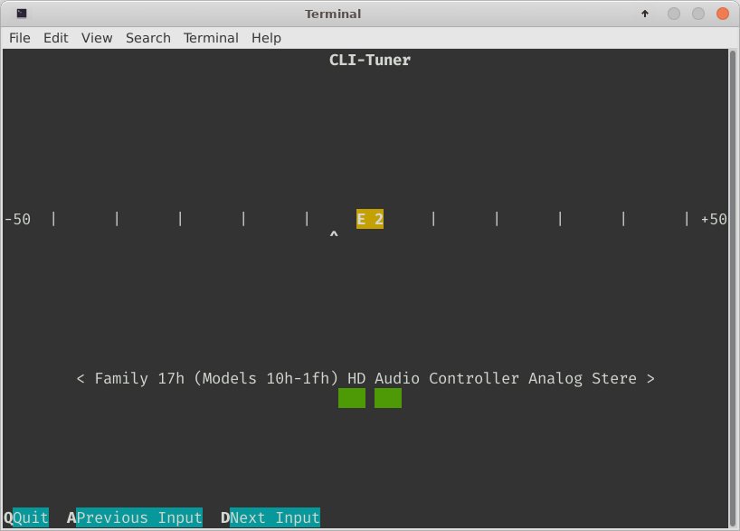

# CLI-Tuner

CLI-Tuner is an instrument tuner for the command-line. It detects the current pitch of an audio signal from any input device (microphone, line-in, etc.) and shows the nearest note as well as the deviation in cents.



# Installation

CLI-Tuner can be either installed from source or from ready-made packages (deb/rpm).

## Installation from Packages

Choose the correct package for your distribution from the sidebar to the right and install it with your package manager.

## Installation from Source

If you want to install from source, go through the following steps.

### Preparation

The only required library for compilation is SFML 2.5.1 ("Simple and Fast Multimedia Library"). Head to SFML's [download](https://www.sfml-dev.org/download.php) page or - if you're on Linux - install it with your package manager.
As an example for the Aptitude package manager (Debian), use:

```
sudo apt install libsfml-dev
```

Once you have the required SFML library, clone the repository (you need *git* for this):

```
git clone https://github.com/DGX2000/CLI-Tuner
```

Enter the folder and go on to the next step.

### Compilation

CMake is used as build system. On Linux the program can be built and compiled in the following way:

```
mkdir build && cd build && cmake ..

make
```

### Installation

CLI-Tuner can be installed to **/usr/bin** by executing:

```
sudo cmake --build . --target install
```

from inside the build directory.

# Documentation

The documentation can be generated with [doxygen](https://www.doxygen.nl/index.html). At minimum the version 1.9.1 of doxygen is needed, if this prerequisite is fulfilled, the documentation can be generated by executing

```
make doc
```

in the build directory that was previously prepared in the compilation step.

# Roadmap

- [ ] Clean up code (many TODOs in there and general ugliness to be fixed)
- [X] Add installation to CMake
- [ ] Add packaging to CMake
- [ ] Add documentation
- [ ] Add a low-pass filter for the tuning (I suspect that on cheap laptop microphones, the tuning below ~150 Hz is inaccurate due to damping; have to verify and measure it though)
- [ ] Fix crash when there is no input device at the moment
